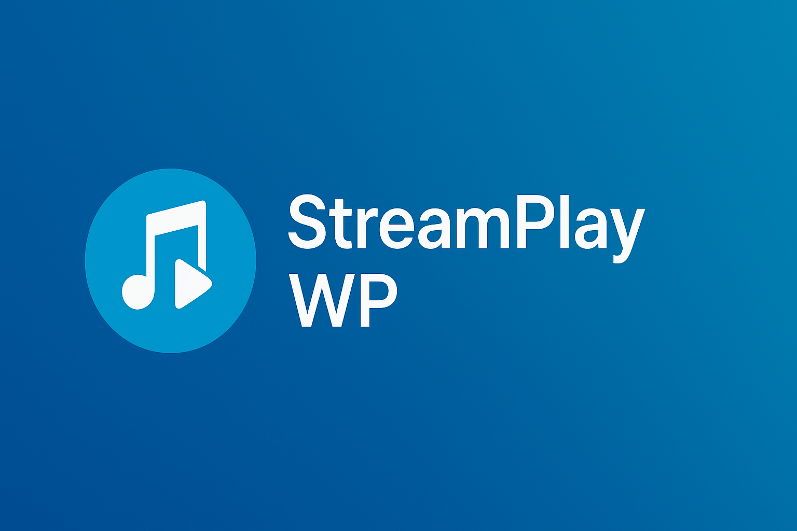

<p align="center">
  
</p>

# StreamPlay WordPress

## Descripción

**StreamPlay WordPress** es un plugin para insertar reproductores de audio HTML5 avanzados con Plyr.js en sitios WordPress.  
Permite manejar múltiples streams, visualizar dinámicamente el título de la canción, garantizar exclusividad, y personalizar la interfaz.  
Diseñado modularmente para futuras extensiones como favoritos, listas de reproducción, estadísticas y panel administrativo.

Incluye botón Stop que destruye y reconstruye el reproductor para garantizar reconexión limpia, evitando errores por cache.  
Compatible con escritorio y dispositivos móviles.

---

## 📦 Versión actual
**v2.1.9e**  
Ver detalles → [`CHANGELOG.md`](CHANGELOG.md)  
Notas por versión → [`RELEASES.md`](RELEASES.md)  

---

## 🚀 Instalación

1. Subí el `.zip` del plugin a WordPress.
2. Activá el plugin desde la sección de Plugins.
3. Insertá el shortcode:

```php
[streamplay]
```

---

## 🎧 Funcionalidades

✅ Reproductores con estilo moderno (Plyr.js).  
✅ Botón Stop alineado al lado de Play/Pause.  
✅ Reconexión limpia al presionar Play.  
✅ Exclusividad entre reproductores activos.  
✅ Visualización dinámica del título de la canción.  
✅ Actualización automática de estilos (CSS cache-busting).  
✅ Toggle para ocultar reproductores en mobile.

---

## 🧱 Arquitectura técnica

- Diseño modular.
- Sin dependencia de proxy externo.
- Manejo de streams directos vía HTML5.
- Uso de `admin-ajax.php` para scrap dinámico de títulos.

Ver detalles → [`ARCHITECTURE.md`](ARCHITECTURE.md)

---

## 📅 Roadmap de funcionalidades

- 🎛️ Panel Admin con gestión dinámica de streams.
- ⭐ Favoritos por usuario.
- 📊 Estadísticas de reproducción.
- 📱 Control remoto multi-dispositivo.
- 🎵 Soporte para listas de reproducción.
- 🎨 Personalización avanzada de UI.

Ver planificación → [`ROADMAP.md`](ROADMAP.md)

---

## 🧾 Documentación complementaria

- [`RELEASES.md`](RELEASES.md) → versiones v1.0.0 a v2.1.9e  

- [`CHANGELOG.md`](CHANGELOG.md) → historial completo de versiones

---

## 👨‍💻 Autor

Desarrollado por **Ruben Cardozo**  
